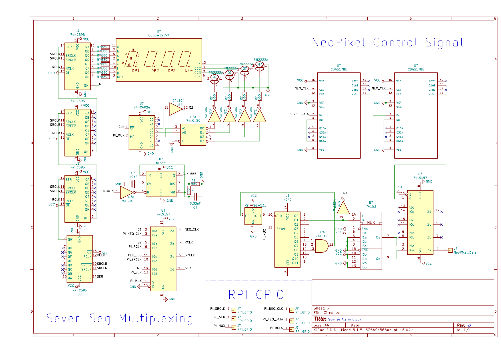

# Hardware Rev 2

This folder contains a KiCad project for the Revision 2 of my clock hardware.
This will be updated, as it does not quite work right and is overly complicated.
I opted to stick to a picture of the schematic and not a picture of the actual circuit,
because the wiring on the physical circuit is embarassingly messy...
I have never been formally taught how to make hardware schematics (I taught myself),
so if you have any suggestions I would be glad to hear them!

## Schematic

